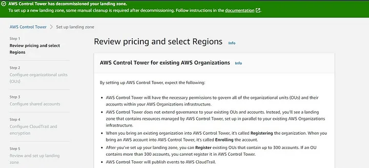
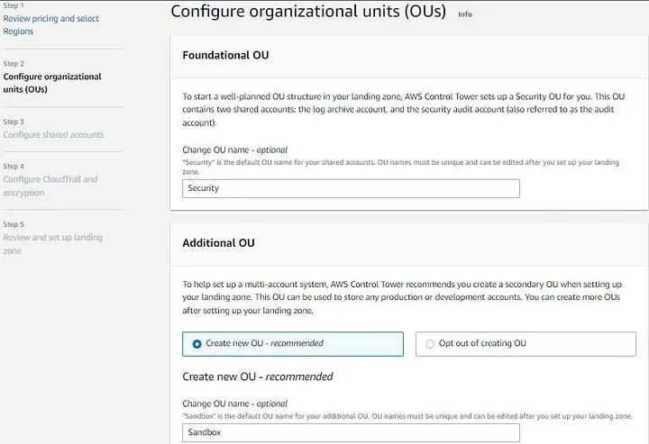
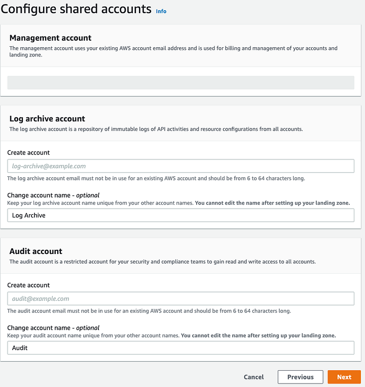
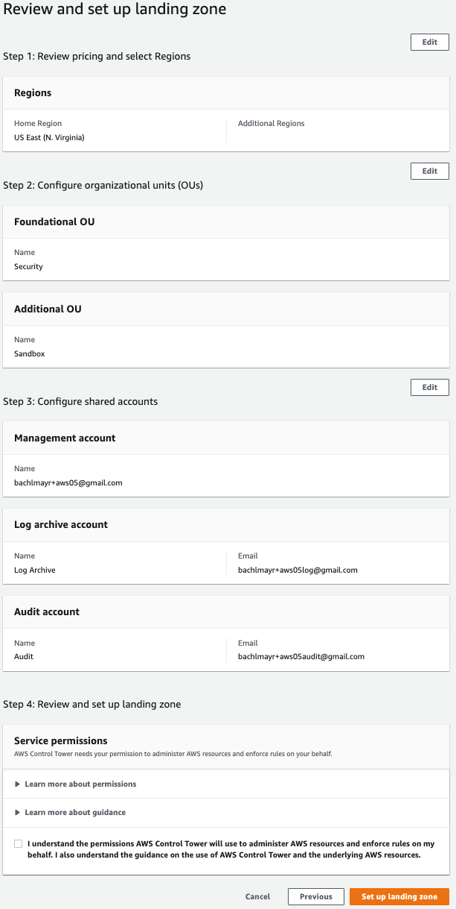
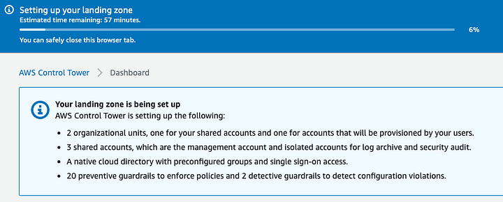
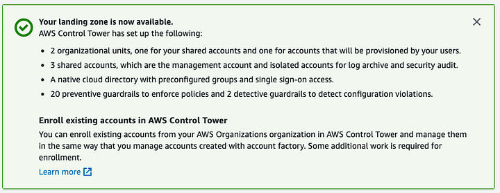

<h1 align=""> AWS Control Tower Architecture</h1>

## Introduction

AWS Control Tower is a managed service that provides the easiest way to set up and govern a new, secure, multi-account AWS environment based on best practices established through AWS experience working with thousands of enterprises as they move to the cloud.

## Architecture

AWS IAM Identity Center (successor to AWS Single Sign-On) is a web-based service for securely controlling access to other AWS services. With IAM, you can centrally manage users, along with their security credentials such as access keys and permissions that designate the AWS resources to which specific users and applications are granted access.

## Deploy AWS Control Tower

**Step 1.** Log in to the AWS Management Console of the AWS Account and go to AWS Control Tower Service

**Step 2.** On AWS Control Tower home page, select Set up landing zone.

**Step 3.** In the Set up landing zone page you will be give the various inputs and acknowledgement
1. Configure Organisation Unit

2. Configure shared accounts

**Step 4.** Review and proceed with the installation, check the terms and conditions box and click on Set up Landing Zone.

You will be redirected to the AWS Control Tower Dashboard.

Wait for the green checkmark 

### Add user or group to Access Accounts
**Step 1.** Go to IAM Identity Center.

**Step 2.** On left side select AWS Accounts.

**Step 3.** Check the box for account which you want to access and select Assign user or group.

**Step 4.** Check the box for group and select next.

**Step 5.** Select the permission and select next.

**Step 6.** Review all the configuration and select submit.

 
This repository have all of the templates for the services that we deployed using AWS Control Tower in /template directory

## Templates

- [AWS Config](https://github.com/clouddrove/aws-control-tower-architecture/tree/master/templates/config)

AWS Config provides a detailed view of the resources associated with your AWS account, including how they are configured, how they are related to one another, and how the configurations and their relationships have changed over time. AWS Config has pricing dimensions based on the number of resources recorded, evaluation rules, and conformance pack evaluation.

- [AWS Access Analyser](https://github.com/clouddrove/aws-control-tower-architecture/tree/master/templates/access-analyser)

AWS Identity and Access Management Access Analyser helps identify potential resource-access risks by enabling you to identify any policies that grant access to an external principal.This CloudFormation Template creates a Lambda Function that uses Environment Variables to leverage parameters parsed into it using CloudFormation Parameter.
- [AWS GuardDuty](https://github.com/clouddrove/aws-control-tower-architecture/tree/master/templates/guardduty)

GuardDuty can continuously monitor any AWS account or workload for malicious activity and unauthorized behaviour. The AWS CloudFormation template deploys the EnableGDDelegatedAdminLambda Lambda function with appropriate access permissions.

- [AWS Securityhub](https://github.com/clouddrove/aws-control-tower-architecture/tree/master/templates/security-hub)

AWS Control Tower is integrated with AWS Security Hub to provide detective controls that help you monitor your AWS environment. The AWS CloudFormation template deploys SecurityHub Enabler lambda function in the master account.

- [Inspection Lambda](https://github.com/clouddrove/aws-control-tower-architecture/tree/master/templates/inspection-lambda)

Inspection Lambda inspect your Control Tower based multi-account environment from your Control Tower Audit account. The use case for inspection in this example looks for dangling Route53 DNS records for A records pointing to IP addresses that your accounts no longer own. The AWS CloudFormation template deploys Inspection Lambda.

- [AWS Macie](https://github.com/clouddrove/aws-control-tower-architecture/tree/master/templates/macie)

Amazon Macie is a data security service that discovers sensitive data by using machine learning and pattern matching, provides visibility into data security risks, and enables automated protection against those risks.To help you manage the security posture of your organization's Amazon Simple Storage Service (Amazon S3) data estate, Macie provides you with an inventory of your S3 buckets, and automatically evaluates and monitors the buckets for security and access control. If Macie detects a potential issue with the security or privacy of your data, such as a bucket that becomes publicly accessible, Macie generates a finding for you to review and remediate as necessary.

- [AWS Inspector](https://github.com/clouddrove/aws-control-tower-architecture/tree/master/templates/inspector)

Amazon Inspector is an automated vulnerability management service that continually scans Amazon EC2 and container workloads for software vulnerabilities and unintended network exposure. Using Amazon Inspector you can manage multiple accounts that are associated with AWS Organizations by simply delegating an administrator account for Amazon Inspector. The delegated administrator manages Amazon Inspector for the organization and is granted special permission to perform tasks on behalf of your organization.

- [AWS Detective](https://github.com/clouddrove/aws-control-tower-architecture/tree/master/templates/detective)

Amazon Detective makes it easy to analyze, investigate, and quickly identify the root cause of security findings or suspicious activities. Detective automatically collects log data from your AWS resources. It then uses machine learning, statistical analysis, and graph theory to help you visualize and conduct faster and more efficient security investigations.

- [AWS Backup](https://github.com/clouddrove/aws-control-tower-architecture/tree/master/templates/awsbackup)

AWS Backup offers a cost-effective, fully managed, policy-based managed service that simplifies data protection at scale. AWS Backup leverages AWS Organizations to centrally automate backup policies to implement, configure, manage, and govern backup activity across supported AWS resources.

 

Follow the documents for deployment steps the above services:
### Documents 
- [AWS Config](_docs/Config.pdf)
- [AWS Access Analyser](_docs/AccessAnalyser.pdf)
- [AWS GuardDuty](_docs/GuardDuty.pdf)
- [AWS SecurityHub](_docs/SecurityHub.pdf)
- [Inspection Lambda](_docs/InspectionLambda.pdf)
- [AWS Macie](_docs/AwsMacie.pdf)
- [AWS Inspector](_docs/AWSInspector.pdf)
- [AWS Detective](_docs/AWSAWSDetective.pdf)
- [AWS Backup](_docs/AWSBackup.pdf)

## References
- [AWS Control Tower Workshop](https://catalog.workshops.aws/control-tower/en-US)
- [AWS Control Tower Labs](https://controltower.aws-management.tools/immersionday/)
